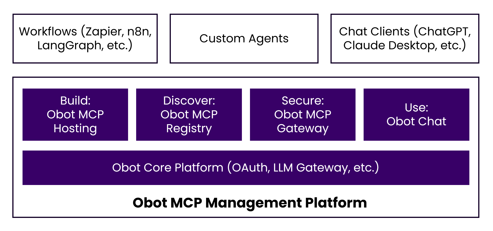

# Obot

Obot is an open-source platform that provides everything an organization needs to implement MCP technologies. It enables you to host MCP servers for internal and external users, set up MCP registries, manage and monitor MCP usage, and build feature-rich agents and chatbots that leverage MCP servers.


## Getting Started

To run Obot locally, start it with Docker:

```bash
docker run -d --name obot -p 8080:8080 \
  -v /var/run/docker.sock:/var/run/docker.sock \
  -e OPENAI_API_KEY=<API KEY> \
  ghcr.io/obot-platform/obot:latest
```

Open [http://localhost:8080](http://localhost:8080) in your browser to access the Obot UI.

**Note**: Replace `<API KEY>` with your OpenAI API key. You can also set `ANTHROPIC_API_KEY` or configure model providers through the admin UI.

For additional installation options, see the Installation Guide at [https://docs.obot.ai/installation/general](https://docs.obot.ai/installation/general).

## Platform Components

Organizations face several challenges when implementing MCP technologies:

* **Build**: While MCP servers can be developed using SDKs of choice, IT teams need a reliable way to host these servers for both private and public use.
* **Discover**: With tens of thousands of MCP servers available, users need a clear and trusted way to discover servers that have been approved by IT administrators.
* **Secure**: MCP servers must be authenticated, access must be controlled, and all activity should be auditable.
* **Use**: MCP protocol support varies widely across chat clients. A standardized chat client that provides consistent MCP support across the organization is highly desirable.

Obot addresses these challenges by offering MCP hosting, an MCP registry, an MCP gateway, and an MCP-standards-compliant chat client. Popular workflow and agent frameworks such as n8n and LangGraph can interact with MCP servers managed by Obot. In addition, clients like ChatGPT, Claude Desktop, and GitHub Copilot can also leverage MCP servers managed by Obot.




### MCP Hosting

Run and manage MCP servers directly within Obot:

* Run MCP servers locally with Docker or deploy them to Kubernetes
* Support for Node.js, Python, and container-based servers
* Support for both single-user STDIO servers and multi-user HTTP servers
* Controls for who can deploy servers, publish them to the catalog, or share them
* Built-in OAuth 2.1 and token handling for authentication

### MCP Registry

A central place to list and discover MCP servers:

* Curated catalog of available MCP servers
* Shared credentials and authentication handled by the platform
* Conformance with the MCP registry specification
* Server visibility based on user access

### MCP Gateway

A single entry point for accessing MCP servers:

* Access rules for users and groups
* Logging of MCP requests and responses
* Usage visibility to understand which servers are being used
* Request inspection and filtering before requests reach servers

### Obot Chat

A chat client built to work directly with MCP:

* Support for multiple model providers including OpenAI and Anthropic
* Add domain-specific information to conversations with built-in RAG
* Project-wide memory to maintain important context across conversations for personalized interactions
* Create and share reusable project configurations with other users
* Scheduled tasks for recurring workflow automations

## Technical Advantages

* **Self-Hosted**: Deploy on your own infrastructure for complete control over data and security
* **MCP Standard**: Built on the open Model Context Protocol for maximum interoperability
* **Security-First Design**: OAuth 2.1, encryption at rest and in transit, comprehensive audit logging
* **Extensible**: Easy integration with custom tools, services, and existing systems
* **GitOps Ready**: Manage catalog and configuration as code

## Documentation

Documentation is available at [https://docs.obot.ai](https://docs.obot.ai).

## Community

* Documentation: [https://docs.obot.ai](https://docs.obot.ai)
* Discord: [https://discord.com/invite/9sSf4UyAMC](https://discord.com/invite/9sSf4UyAMC)

## License

Obot is open-source software. See the LICENSE file for details.
