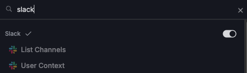
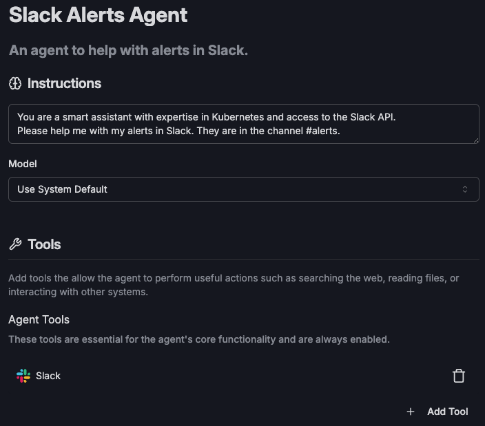
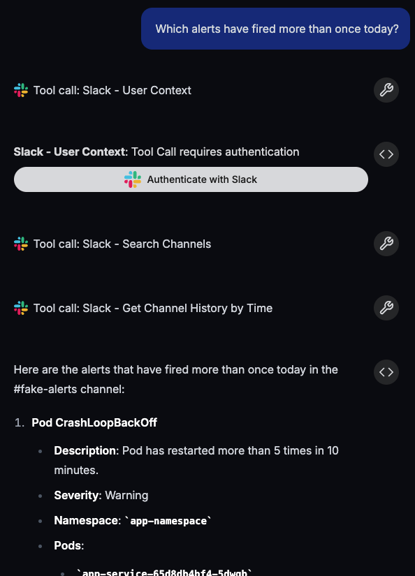

# Create a Slack Alerts Agent

This is a short tutorial demonstrating how to create an Obot agent that helps with alerts in a Slack channel.

:::note
As you configure the agent, changes will be saved and applied automatically.
:::

## 1. Setting up the agent

Start by going to the Agents page in the admin UI and clicking **+ New Agent**.
Set the agent name and description to whatever you would like.

Next, write some instructions for the agent.
Tell it about which Slack channel contains the alerts, and what systems the alerts could come from.
Here is an example:

```text
You are a smart assistant with expertise in Kubernetes and access to the Slack API.
Please help me with my alerts in Slack. They are in the channel #alerts.
```

## 2. Adding the tools

Now we need to give the agent access to the Slack tools.
Click on the **+ Add Tool** button and search for `Slack`.
You should see a whole category of tools for Slack.
Click on the toggle button at the right side of the category name to add all the Slack tools to the agent.



When you are finished configuring the agent, it should look something like this:



## 3. Testing the agent

You can now begin chatting with the agent in the chat interface to the right.
Ask it something related to your alerts.
For example, you can ask it to look at your alerts today, and let you know about any that have fired more than once.
The first time it tries to interact with Slack, you will have to sign in to authorize the agent to access your account.



You can also ask it to come up with remediation steps for you.

## 4. Publishing the agent (optional)

If you're happy with the agent and want other users on your Obot instance to be able to use it,
you can click the **Publish** button on the agent configuration page.
This will make it available in the user UI for all users to chat with.
Each user will have to sign in to Slack on their own when prompted to do so by the agent.
